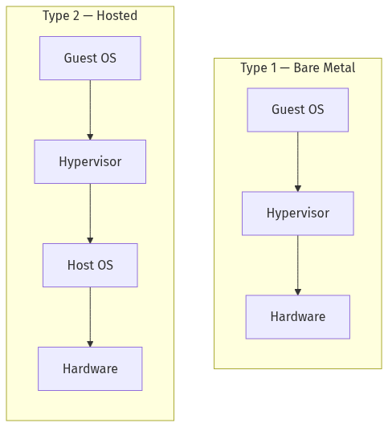
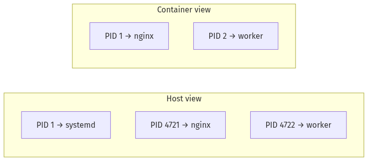
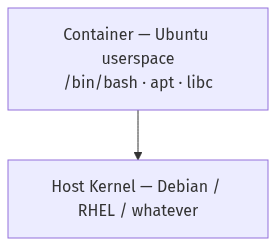
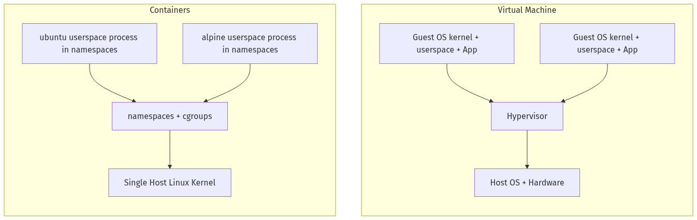
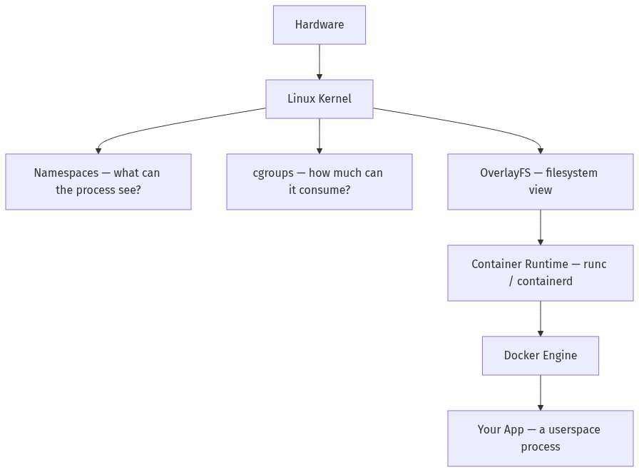

---
tags:
  - containers
  - devops
  - docker
  - kernel
  - operating-system
  - virtualization
---

# VMs vs Containers: A Story the Kernel Was Already Telling

> Most comparisons start with a diagram of boxes. This one starts with a question: _what does it actually mean for a process to be "isolated"?_ If you understand that, Docker stops feeling like magic and starts feeling like a thin wrapper around something Linux has been doing for years.

---

## What Is a Process, Really?

When you run a program, the kernel creates a **process** — a running instance of that program in **userspace**.

Quick clarification on the two spaces:

- **Kernel space** — where the OS kernel runs. It has full access to hardware, memory, and every resource on the machine. Only the kernel lives here.
- **User space** — where every application runs: your Node.js server, your browser, your database, Docker itself. These processes can't directly touch hardware — they have to ask the kernel via **system calls (syscalls)**.

> **Every container you run is a userspace process.** Not a mini OS, not a VM — just a regular Linux process, configured to have a restricted view of the world.

Every process in userspace gets a set of **views** into the system:

- A **PID** — its ID in the kernel's process table
- A **virtual memory** space — its private view of RAM
- **File descriptors** — open files, sockets, pipes
- A **root filesystem** — where `/` actually points
- A **network stack** — interfaces, ports, routing

The key word is _view_. The kernel is the single source of truth. A process doesn't _own_ these resources — it sees a **slice** that the kernel projects for it.

> **This is the insight everything builds on.**

---

## The Problem: Everything Is Global by Default

Out of the box, all userspace processes on a Linux machine share the **same global view** of everything.

Run `ps aux` and you see _every_ process on the machine. Run `ip link` and you see every network interface. Two processes can't both bind port 3000 — the port space is shared.

This creates two serious problems when running multiple workloads on one machine:

**1. Lack of isolation** — a process can see, signal, or interfere with everything else running on the host.

**2. The Noisy Neighbor Problem** — one process can consume all available CPU or RAM, starving every other process on the machine. In a shared hosting environment, one misbehaving tenant ruins everyone else's day. There's no enforcement mechanism — the greedy process just takes what it wants, and the kernel happily hands it over.

The first solution people reached for was Virtual Machines.

---

## The VM Approach: Fake the Whole Machine

A hypervisor **virtualizes the hardware itself** — emulating CPUs, memory, NICs, disks. A full guest OS boots inside this fake machine, thinking it owns real hardware.

There are two types of hypervisors:

**Type 1 — Bare Metal:** The hypervisor runs _directly on the hardware_ with no host OS underneath. It is the OS. This is what data centers and cloud providers use — it's faster and more efficient because there's no extra OS layer in between._Examples: VMware ESXi, Microsoft Hyper-V, KVM (Linux)_

**Type 2 — Hosted:** The hypervisor runs _on top of a regular OS_, like any other application. You install it on your laptop and it sits above Windows or macOS. Easier to set up, slightly more overhead. _Examples: VirtualBox, VMware Workstation, Parallels_



**Isolation is total** — but the cost is high:

- Each VM carries a full OS kernel (hundreds of MB to several GB)
- Boot time is seconds to minutes
- You wanted to run 50 Node.js apps. You ended up running 50 entire Linux installations.

---

## Linux Already Had the Answer: Namespaces + cgroups

Here's the insight: you don't need to fake hardware to isolate a process. You need two things:

- **Control what it can _see_** → **Namespaces**
- **Control what it can _consume_** → **cgroups**

Both are kernel features Linux has had for years. Docker is essentially a friendly interface on top of them.

---

### Namespaces — Controlling What a Process Can See

A **namespace** wraps a global kernel resource and makes it appear **private** to a specific set of processes. The kernel still manages one physical reality underneath — but different processes see different versions of it.

Think of it like a building with one real floor plan, but each department only gets a map of their own section. The building is the same. The maps are different.

Docker uses **6 core namespace types**:

---

#### 🔵 PID Namespace — _"Who else exists?"_

**The problem:** Every process has a unique PID. Any process can look up or signal any other process by its PID. One service can accidentally (or maliciously) kill another.

**What it does:** When a process is placed in a new PID namespace, it becomes **PID 1** inside that namespace — it thinks it's the first and only process. It can only see its own children. Everything outside is invisible to it.



The host can reach in and signal container processes (how `docker stop` works). The container cannot see or touch anything outside its namespace.

---

#### 🔵 Network Namespace — _"What network do I have?"_

**The problem:** All processes share the same network interfaces and port space. Two apps can't both listen on port 3000.

**What it does:** A new network namespace starts completely blank — no interfaces, no routes, no open ports. Docker then creates a **virtual network cable** (a veth pair): one end lives inside the container, the other connects to a bridge on the host.


The container binds to port 3000 _inside its own private network namespace_. Docker adds a NAT rule to forward `host:3000 → container:3000`.

This is why **two containers can both use port 3000** without conflict — they're in different network namespaces. Each has its own isolated port space.

---

#### 🔵 Mount Namespace — _"What does my filesystem look like?"_

**The problem:** All processes share the same global filesystem tree. Any process can see (or mess with) files anywhere on the host.

**What it does:** A new mount namespace gives the process its own private view of the filesystem. Docker uses this to point the container's `/` at the image's filesystem directory on the host. The container thinks it's running on Ubuntu. The host sees it as files inside `/var/lib/docker/...`.

> This is how you run an Ubuntu container on a Debian host — the container gets Ubuntu's _files_, not Ubuntu's _kernel_.

---

#### 🔵 UTS Namespace — _"What's my hostname?"_

**The problem:** All processes see the same hostname.

**What it does:** Gives the container its own isolated hostname. Run `hostname` inside a container → you get the container ID. Run it on the host → you get the host's name. Same kernel, different answer.

Simple, but critical for logging, service discovery, and any config that depends on hostname.

---

#### 🔵 User Namespace — _"Who am I?"_

**The problem:** A process running as root (UID 0) has full power over the entire host.

**What it does:** Maps user IDs _inside_ the namespace to _different_ user IDs on the host. A process thinks it's `root` inside the container, while actually being an unprivileged user on the host.


If a container process tries to do something destructive, the kernel checks the _host_ UID — which has zero special privileges. This is the foundation of **rootless containers**.

---

#### 🔵 IPC Namespace — _"What shared memory can I see?"_

Isolates inter-process communication (shared memory segments, message queues). Containers can't accidentally read each other's in-memory data. Each container gets its own private IPC world.

---

### cgroups — Solving the Noisy Neighbor Problem

Namespaces answer _"what can a process see?"_ — but the noisy neighbor problem is about _"how much can it consume?"_

Without limits, one runaway process can eat all CPU and RAM and starve everything else on the machine. **cgroups**(control groups) solve this by letting the kernel enforce hard resource limits on a group of processes — directly at the scheduler level, not via userspace polling.

The key controllers Docker uses:

|Controller|What it limits|
|---|---|
|`memory`|Max RAM — process gets OOM-killed if it exceeds this|
|`cpu`|CPU share and hard time quota|
|`pids`|Max number of processes (prevents fork bombs)|
|`blkio`|Disk read/write throughput|

When you run:

```bash
docker run --memory=512m --cpus=1.5 nginx
```

Docker writes those values into the kernel's cgroup filesystem. The kernel enforces them automatically. If the container tries to use 600 MB of RAM, the kernel's OOM killer terminates a process inside the group — the host and every other container are completely unaffected.

> **cgroups are the direct answer to the noisy neighbor problem.** One container can't starve another because the kernel enforces hard ceilings at the process-group level.

---

## What Docker Actually Is

Now that we understand the primitives, Docker is simple to explain.

**Docker is a userspace process launcher** that sets up namespaces + cgroups + a layered filesystem, then starts your app inside that configured environment.

When you run `docker run ubuntu bash`:

1. **Assembles the filesystem** — Docker layers the image's files using OverlayFS. Lower layers are read-only; a thin writable layer sits on top for runtime changes.
2. **Creates namespaces** — a Linux syscall (`clone()`) creates a new userspace process with fresh PID, network, mount, UTS, user, and IPC namespaces.
3. **Sets up cgroups** — resource limits are written into the kernel's cgroup hierarchy.
4. **Pivots the root** — the container's `/` is pointed at the image's filesystem.
5. **Starts your process** — inside the fully prepared, isolated environment.

The result: a **userspace process** that thinks it's living on a fresh machine, but is just another entry in the host's process table.

> **Docker doesn't virtualize anything. It configures the kernel's existing isolation features and launches a userspace process.**

---

## Why Any Linux Distro Works Inside a Container

_"If I run an Ubuntu container on a Debian host, which kernel is running?"_

**One kernel: the host's.** Always.

What the container gets is Ubuntu's **userspace** — its filesystem, its `apt`, its shell, its system libraries. The kernel is shared.



This works because **all Linux distros speak the same syscall language** to the kernel. Ubuntu, Alpine, Arch, RHEL — they all use the same `open()`, `read()`, `fork()` calls. The kernel ABI is stable and universal. What differs between distros is just what's in the userspace on top.

> This is also why **you can't run a Windows container on a Linux host** without a VM — Windows speaks Windows kernel syscalls, not Linux ones.

---

## The Honest Comparison



||Virtual Machine|Container|
|---|---|---|
|**Isolation unit**|Virtual hardware|Kernel namespaces|
|**What's running**|Full guest OS + kernel|Userspace process only|
|**Kernel**|Each VM has its own|Shared with host|
|**Boot time**|Seconds to minutes|Milliseconds|
|**Image size**|GBs (full OS)|MBs (userspace only)|
|**Density**|Tens per host|Hundreds per host|
|**Noisy neighbor**|Hypervisor enforces separation|cgroups enforce hard limits|
|**Security boundary**|Hypervisor (very strong)|Kernel namespaces (strong, but shared kernel)|
|**OS flexibility**|Any OS (Windows, BSD, Linux)|Must match host kernel ABI|

---

## Summary — What's Really Happening

Docker is not a virtualization technology. It is a **namespace and cgroup orchestrator** that launches isolated userspace processes.



When you run `docker run`, you're not booting a machine. You're asking the kernel to start a **userspace process** with a curated, restricted view of the world, and a hard ceiling on what it can consume.

**The kernel does the actual work. Docker fills in the forms.**

The containers were already in the kernel. Docker just made them approachable.

## See also

- [[Docker]] · [[Docker Volumes Mounts and Networking]] · [[Virtualization vs Containerization]]
